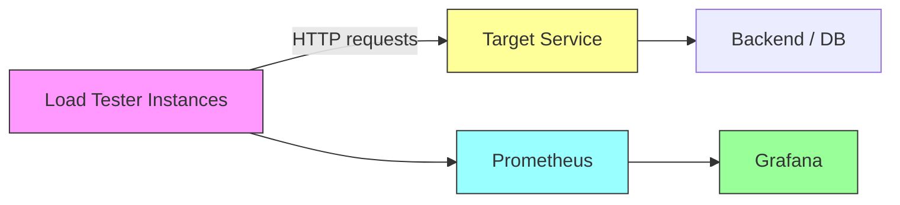

Load tests (step 6)

This folder provides a compact asyncio-based load tester and instructions to run it locally or in Docker, observe metrics, and reason about backpressure choices.

Files
- load_test.py: small load test runner (aiohttp + optional prometheus_client)

Quick setup (local)
1. Create a virtualenv and install deps:
   python -m venv .venv && source .venv/bin/activate
   pip install --upgrade pip
   pip install aiohttp prometheus_client

2. Run a quick smoke test:
   python loadtests/load_test.py --target http://localhost:8000/ --concurrency 10 --duration 10

Docker usage
1. Example Dockerfile (build in repo root):
   FROM python:3.11-slim
   WORKDIR /app
   COPY loadtests/ ./loadtests/
   RUN pip install --no-cache-dir aiohttp prometheus_client
   ENTRYPOINT ["python", "loadtests/load_test.py"]

2. Build and run:
   docker build -t loadtester .
   docker run --rm loadtester --target http://example:80/ --concurrency 50 --rps 200 --duration 30

Running load tests
- Basic run:
  python loadtests/load_test.py --target <URL> --concurrency 100 --duration 60

- With target RPS throttle (client-side):
  python loadtests/load_test.py --target http://localhost:8000/ --concurrency 200 --rps 500 --duration 60

- Expose Prometheus metrics (requires prometheus_client installed):
  python loadtests/load_test.py --target http://localhost:8000/ --concurrency 50 --metrics-port 9000 --duration 120

What the script reports
- Periodic reports (every 5s by default) showing total requests, success, errors, average latency and p90.
- Final summary with p50/p90/p99/avg/min/max latency in milliseconds and request counts.
- If --metrics-port is provided and prometheus_client is installed, the script exposes metrics on that port for scraping.

Observing metrics
- Console: default periodic and final summaries printed to stdout.
- Prometheus: start the script with --metrics-port 9000. Prometheus scrape config example:
  scrape_configs:
    - job_name: 'loadtester'
      static_configs:
        - targets: ['loadtester-host:9000']

- Grafana: create dashboards that read the Prometheus metrics exposed by this script. Useful metrics:
  - loadtester_requests_total (rate())
  - loadtester_errors_total
  - loadtester_request_seconds (histogram)

Mermaid architecture diagram

Backpressure choices and tradeoffs
This load tester implements two client-side controls: a concurrency semaphore and an optional token-bucket rate limiter (RPS). Design choices and tradeoffs:

- Concurrency semaphore (fixed number of in-flight requests):
  - Pros: Limits resource usage (sockets, memory) on the client machine; easy to reason about max parallelism.
  - Cons: Does not directly control request arrival rate; if requests are very short, concurrency cap can generate bursts.

- Token-bucket / RPS limiter:
  - Pros: Controls average request rate towards the target service, enabling steady-state traffic and easier comparison across runs.
  - Cons: Adds client-side throttling which may mask the target service's natural throttling behavior; fine-grained timing accuracy depends on the host scheduler.

- No client-side throttling (unlimited RPS, only concurrency bound):
  - Pros: Simpler and can exercise the network and service at maximum throughput the client can issue.
  - Cons: Can create spikes and unstable load patterns; may overload client or network before the target.

- Backpressure at client vs server-side backpressure:
  - Client-side throttling is safe and predictable for benchmarking but may not reveal how the system behaves under uncontrolled spikes.
  - Server-side backpressure (timeouts, connection limits, queueing) should be part of system testing: inducing load beyond capacity helps validate graceful degradation.

- Memory and metrics tradeoffs:
  - This script stores up to 100k latency samples to compute percentiles. For very long/high-throughput runs, consider a streaming percentile estimator (TDigest) or exporting histograms to Prometheus.

IMPLEMENTATION_PLAN.md
- Note: The full implementation plan is tracked in IMPLEMENTATION_PLAN.md at the repo root (to be added). Briefly, steps are:
  1. Provide a compact, dependency-light load_test.py (done here).
  2. Add Dockerfile and CI job to run smoke load tests.
  3. Add optional advanced modes: POST payloads, auth headers, connection reuse tuning.
  4. Add TDigest or streaming histogram for low-memory percentile calculations.
  5. Add example Prometheus + Grafana dashboards.

Tips
- If you see client-side socket exhaustion, reduce concurrency or increase system file descriptor limits.
- To validate server backpressure behavior, run tests that exceed capacity and observe server-side metrics (queue sizes, error rates, latencies).

Feedback / extensions
- Add support for custom headers, body payloads, and scenarios (ramp-up, steps, bursts).
- Integrate with k6 or locust for richer user scenarios if needed.
